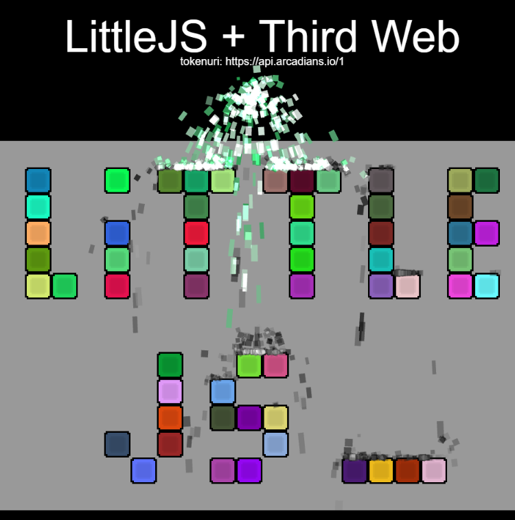

# Third Web SDK usage for Little JS

This example loads the Third Web SDK using async imports on game start

## Getting Started


 * add ```THIRDWEB_SECRET_KEY``` in game.ts
 * run ```build.bat```
 * start a server with ```npx http-server```
 * play game on http://localhost:8080
 * If successful, we can see the tokenURI updated

 